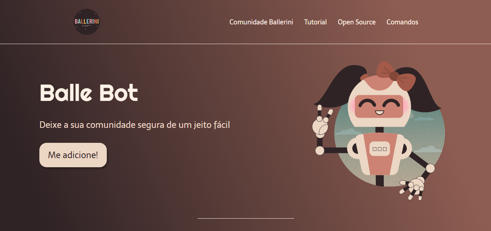

<h1 align="center">  Landing Page </h1>

  <a href="#-tecnologias">Tecnologias</a>&nbsp;&nbsp;&nbsp;|&nbsp;&nbsp;&nbsp;
  <a href="#-projeto">Projeto</a>&nbsp;&nbsp;&nbsp;|&nbsp;&nbsp;&nbsp;
  <a href="#-layout">Layout</a>&nbsp;&nbsp;&nbsp;|&nbsp;&nbsp;&nbsp;
  <a href="#memo-licença">Licença</a>

  

 

  

## 🚀 Tecnologias

Esse projeto foi desenvolvido com as seguintes tecnologias:

- HTML  
- CSS
- Figma
- Git e Github

## 💻 Projeto

Foi criado essa Landing Page para Desktop apenas para praticar o layout da página.    

## 🔖 Layout

Você pode estar visualizando o layout do projeto através.
[Desse link](https://www.figma.com/file/myqP66iQwzjwjrIAJyyrip/BalleBot?type=design&node-id=0-1&t=QTnktz6Cqeyublpm-0). 
É necessário ter uma conta no [Figma](https://www.figma.com/file/myqP66iQwzjwjrIAJyyrip/BalleBot?type=design&node-id=0-1&t=QTnktz6Cqeyublpm-0).

## :memo: Licença

Esse projeto está sob a licença MIT.
